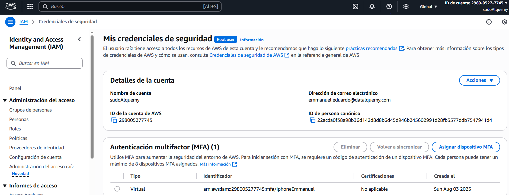
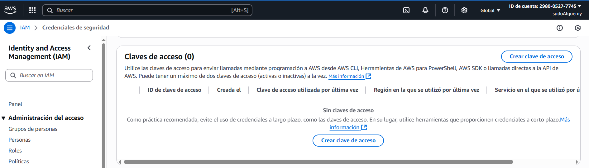

# Fase 1 – Gobierno y seguridad base

## Tarea 1 – Asegurar cuenta root (MFA + bloqueo operativo)

### Objetivo
Proteger la cuenta root con MFA y bloquear su uso operativo, garantizando que no pueda ser usada para tareas del día a día.

### Pasos realizados
1. **Habilitar MFA en root**
   - Inicié sesión como root en [AWS Console](https://signin.aws.amazon.com/console).
   - Fui a *Security Credentials*.
   - Activé MFA tipo Virtual (Google Authenticator en iPhone).
   - Validé con dos códigos consecutivos.
   - 

2. **Verificar y deshabilitar claves root**
   - Revisé sección *Access keys* → confirmado que no hay claves activas (0).
   - Esto garantiza que root no puede usarse vía CLI/SDK.
   - 

3. **Política de uso de root**
   - El root solo se usará para:
     - Facturación.
     - Operaciones críticas de soporte.  
   - Para tareas operativas diarias se usará el usuario `dq-admin`.

### Resultado
- MFA habilitado ✅  
- Root sin claves de acceso ✅  
- Uso operativo de root prohibido ✅  

### Referencias
- AWS Doc: [Root user best practices](https://docs.aws.amazon.com/IAM/latest/UserGuide/id_root-user.html)
